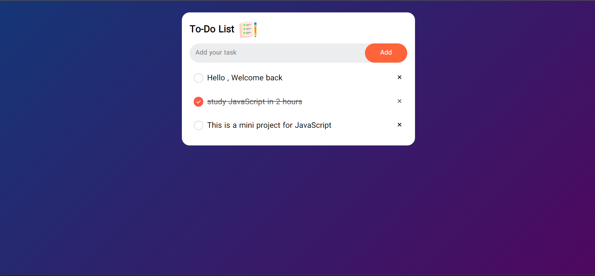

# Hello , Welcome back 

## This Project 
- It is an interesting mini-project to practice JavaScript

**[Go to Live Demo](https://m-sadegh86.github.io/To-Do-List/)**

## What is the purpose of this project ?
- Application of intermediate level topics in JavaScript
- The practice of storing information on local storage